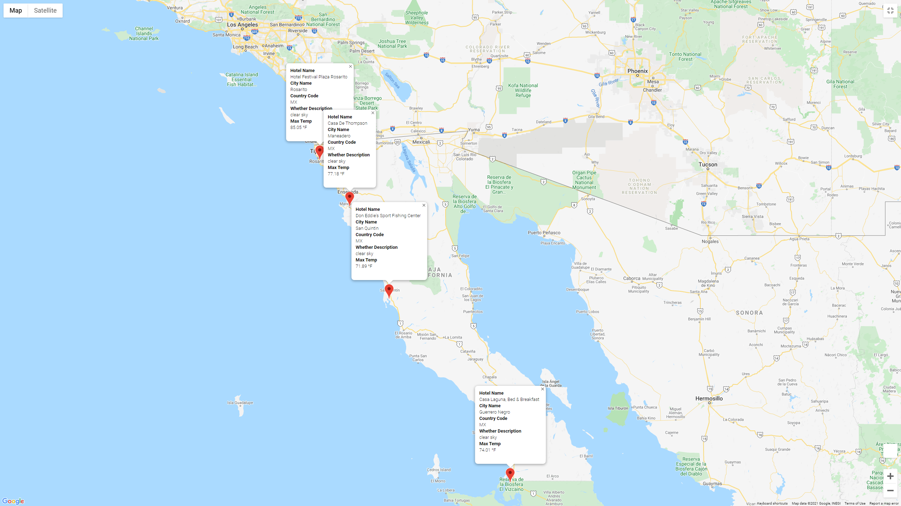

# World Weather Analysis

## Overview
Throughout the module, by utilizing the "PlanMyTrip" app, we were able to assist Jack with specifc data crucial to trip planning. Since the application is a brand new product, it is susceptible to suggested changes to improve the overall user experience. One specific change that was recommended was to add weather description to the weather data already implemented in the app. Another would also be bale to have the feature to implement user specific inputs in order to help them better search potential trip destinations, hotels, weathers and routes. In order to test these new changes, the beta testers will choose four cities to create a travel itinerary by utiizing Google Maps Directions API in order to create a travel route.

## Beta testing vacation itinerary
For this specific challenge, we are looking at four cities relatively near each other on Google Maps. These four cities are: Rosarito, Maneadero, San Quintin, and Guerrero Negro. The city of Rosarito will be our starting and end point in our travel route.

